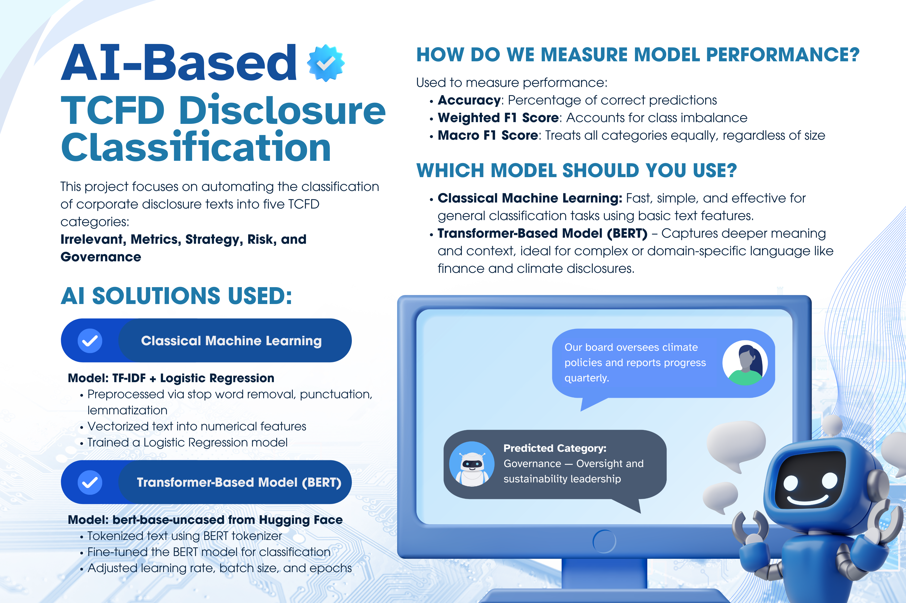

# TCFD Text Classification

This project classifies corporate disclosure paragraphs into specific categories under the **Task Force on Climate-related Financial Disclosures (TCFD)** framework using both classical and deep learning models. It supports both **Logistic Regression with TF-IDF** and **BERT Transformers**, allowing users to interactively classify text via a [Streamlit](https://streamlit.io/) web interface.


---

## What This Project Does

Given a textual paragraph from a corporate disclosure this project predicts its TCFD category:

- **Irrelevant**: General or unrelated to climate  
- **Metrics**: Emissions metrics and reporting  
- **Strategy**: Sustainability strategies and climate initiatives  
- **Risk**: Risk assessment and climate risk management  
- **Governance**: Board oversight and sustainability governance  

---

## Project Structure Guide

```
TCFD-CLASSIFICATION/
├── CS180_Project/          # Contains the Streamlit Website
│ ├── models/
│ │ ├── bert-tcfd/          # Downloadable fine-tuned BERT model
│ │ └── logistic-tcfd/      # Downloadable TF-IDF + Logistic Regression model
│ ├── bert_model.py         # Code for running BERT classification
│ ├── logistic_model.py     # Code for logistic regression classification
│
├── pages/
│ ├── 1_Methodology.py      # Project info (Streamlit tab)
│ ├── 2_Poster.py           # Poster (Streamlit tab)
│ ├── Classification.py     # Main Streamlit demo app
│
├── requirements.txt        # Python dependencies
├── DFS_Poster.png          # Poster image
└── README.md
```

---

## Installation and Setup

### 1. Clone the Repository

```bash
git clone https://github.com/LorraineCstrlln/tcdf-classification.git
cd TCDF-CLASSIFICATION
```

### 2. Create Virtual Environment (Optional but Recommended)

```bash
python -m venv venv
venv\Scripts\activate       # On Windows
# source venv/bin/activate    # On Mac/Linux:
```

### 3. Install Dependencies

```bash
pip install -r requirements.txt
```

> Note: This installs Streamlit, Transformers, Torch, Pandas, Scikit-learn, Pandas, Numpy, etc.

### 4. Download and Place Pretrained Models

The contents of the `/models/bert-tcfd/` and `/models/logistic-tcfd/` folders are too large for GitHub and were saved during model training.

Download the pretrained models using the links below and place them in the specified folders:

| Model               | Cloud Link                                                                 |
|--------------------|------------------------------------------------------------------------------|
| BERT Model          | [Download BERT Model (OneDrive)](https://upsystem-my.sharepoint.com/:f:/g/personal/glcoronel_outlook_up_edu_ph/Eq3gFEuRP5ZGpnoXoTrF0b4BI0YgW5fvvWGv9FCUU6KYOw?e=bVWQtI)                   |
| Logistic Regression | [Download Logistic Model (OneDrive)](https://upsystem-my.sharepoint.com/:f:/g/personal/glcoronel_outlook_up_edu_ph/EuWba6jQJF5NpekZNQcWSQYB49ynKOW7QdjgwLHnTHc80A?e=RdeqWC)               |

After downloading, place them into:

```bash
models/bert-tcfd/       # For BERT model
models/logistic-tcfd/   # For Logistic model
```

### 4. Run the Demo App

```bash
streamlit run Classification.py
```

Open the provided local URL in your browser (usually `http://localhost:8501`).

---

## Demo Features

- Classify **single text input** or **batch CSV upload**  
- Toggle download permissions and filename options  
- View **poster presentation** and **methodology** directly in the app  

---

## Model Methodologies

### Logistic Regression (TF-IDF)
- Preprocessing: Cleaned, lowercased, stopwords removed  
- Vectorization: TF-IDF with n-grams and grid-tuned parameters  
- Model: `sklearn.linear_model.LogisticRegression`  
- Evaluation: Accuracy and confusion matrix on dev/test sets  

### BERT Transformer
- Based on `bert-base-uncased` from HuggingFace  
- Tokenization: WordPiece Tokenizer  
- Fine-tuned using PyTorch with:
  - DataLoaders  
  - Learning rate scheduling  
  - F1 score and accuracy  
- Evaluation: Classification report (precision, recall, F1)  

---

## Training and Evaluation

### Training Code (Not part of demo)

Training scripts are separate from the app to prevent overhead:

- BERT training → `train_bert.py`  
- Logistic training → `train_logistic.py`  
- Evaluation → `evaluate_models.py`  

_These scripts load `dev.csv`, split data, and output models to `/models/`._

---

## References and Resources

### Model Training

- **BERT (Bidirectional Encoder Representations from Transformers)**  
  HuggingFace Transformers (pretrained base model and tokenizer)  
  🔗 [https://huggingface.co/bert-base-uncased](https://huggingface.co/bert-base-uncased)  
  🔗 [https://huggingface.co/docs/transformers](https://huggingface.co/docs/transformers)  

- **Logistic Regression (TF-IDF) using Scikit-learn**  
  Core documentation for implementing and tuning traditional ML models.  
  🔗 [https://scikit-learn.org/stable/](https://scikit-learn.org/stable/modules/linear_model.html#logistic-regression)  

- **PyTorch for Fine-tuning BERT**  
  Used for GPU training, model saving, evaluation, and custom Dataset setup.  
  🔗 [https://pytorch.org/tutorials/](https://pytorch.org/tutorials/)  
  🔗 [https://pytorch.org/docs/stable/index.html](https://pytorch.org/docs/stable/index.html)

- **Dataset Encoding and Label Preprocessing**  
  We used LabelEncoder from Scikit-learn and manual mappings via pandas and numpy.  
  🔗 [https://pandas.pydata.org/docs/](https://pandas.pydata.org/docs/)  
  🔗 [https://numpy.org/doc/](https://numpy.org/doc/)

### Streamlit Deployment and Interface

- **Streamlit Framework**  
  Used to build an interactive web-based interface for classification and model testing.  
  🔗 [https://docs.streamlit.io](https://docs.streamlit.io)  
  🔗 Beginner Guide: [https://blog.streamlit.io/introducing-streamlit/](https://blog.streamlit.io/introducing-streamlit/)

### Additional Resources (Source Dump)

- Fine-Tuning BERT for Text Classification:  
  🔗 [https://curiousily.com/posts/sentiment-analysis-with-bert-and-hugging-face-using-pytorch-and-python/](https://curiousily.com/posts/sentiment-analysis-with-bert-and-hugging-face-using-pytorch-and-python/)  
  🔗 [https://mccormickml.com/2019/07/22/BERT-fine-tuning/](https://mccormickml.com/2019/07/22/BERT-fine-tuning/)

- TF-IDF Text Classification Example:  
  🔗 [https://scikit-learn.org/stable/tutorial/text_analytics/working_with_text_data.html](https://scikit-learn.org/stable/tutorial/text_analytics/working_with_text_data.html)

- Multi-Class Text Classification with BERT:  
  🔗 [https://towardsdatascience.com/multi-class-text-classification-with-bert-897c524e5f24](https://towardsdatascience.com/multi-class-text-classification-with-bert-897c524e5f24)

---

## Authors

Project by:

- Lorraine Gwen M. Castrillon - [LorraineCstrlln](https://github.com/LorraineCstrlln)
- Gavril Benedict L. Coronel - [gbpursuit](https://github.com/gbpursuit)
- Gabriel Inigo De Guzman - [Inigo-D120](https://github.com/Inigo-D120)

*(University of the Philippines - Diliman, Department of Computer Science)*

---

## License

For academic and educational use only. Part of CS 180: Machine Learning coursework.